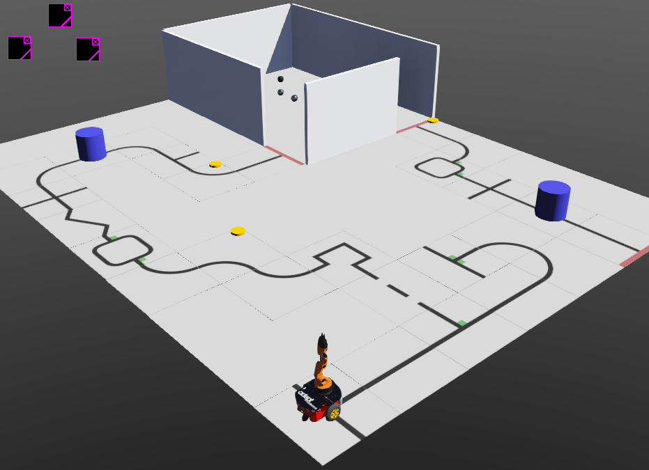

# Webots-Rescue-Line

GitHub Repository for simulation platform following Robocup Junior Rescue Line competition

Important Links (make sure to check descriptions of YouTube videos for further important links):

For everyone:
- [Introduction and Installation Tutorial](https://youtu.be/x2waExn5sEo): IMPORTANT, introduces all features of Webots-Line
- [Interacting with Webots Tutorial](https://youtu.be/WGLQeFt4Ml8) (6:57 - 19:14)

For those using Blockly (drag-and-drop programming):
- [Webots-Blockly Tutorial](https://youtu.be/T_C4VvBAhok)
- [Webots-Blockly Full Documentation](https://www.stormingrobots.com/prod/webots/Webots_Blockly_API_Documentation.pdf)

For those using C++/Python (Java not explicitly covered, but still applicable):
- [Motors Tutorial](https://youtu.be/VYSuGS_mqD0)
- [Sensors Tutorial](https://youtu.be/9wrEgQoo6mc)
- [Webots Full Documentation](https://cyberbotics.com/doc/reference/nodes-and-api-functions)

Important Features:
- Custom color and distance sensor
  - Add object, use Custom PROTO Node
- All Robocup Junior Rescue Line scoring features are implemented
  - E.g. speed bumps, debris, see-saw, intersections, obstacles, etc.
- Evacuation room and robot scoop
  - Add on a robot scoop using robot's extensionSlot group (just like a sensor)
- Blockly drag-and-drop programming
  - Open Scene Tree, right click on BlocklySupervisor Robot, click Show Robot Window
- Scoring window to track points
  - Open Scene Tree, right click on GameSupervisor Robot, click Show Robot Window
- Automatic Scoring
  - Only worlds named "AutoScoring" support automatic scoring
- Map generator
  - Navigate to the line_generator folder, run LineGenerator.py
