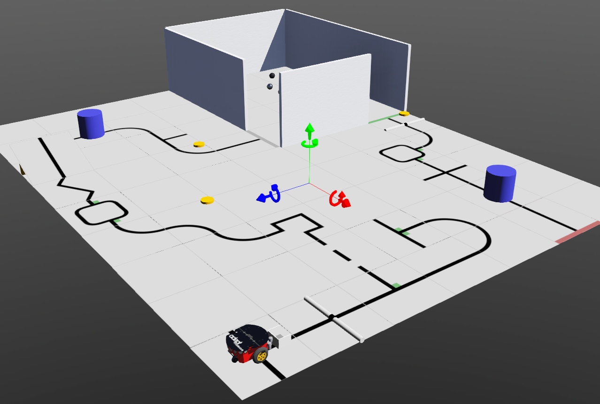

# Webots-Line

GitHub Repository for Robocup Junior Rescue Line Simulation competition

Important Features:
- Custom color and distance sensor
  - Add object, use Custom PROTO Node
- Blockly drag-and-drop programming
  - Open Scene Tree, right click on BlocklySupervisor Robot, click Show Robot Window
- Scoring window to track points
  - Open Scene Tree, right click on GameSupervisor Robot, click Show Robot Window
- Map generator
  - Navigate to the line_generator folder, run LineGenerator.py

Features to be Added/Updated:
- Evacuation room and robot will be updated to allow for easier delivery
- Scoring window will be expanded to encompass all scoring elements
- Speed bumps, debris, and see-saw will be added
- Complete Rescue Line Simualtion documentation will be uploaded

Important Documentation:
- [Introduction to Webots](https://youtu.be/WGLQeFt4Ml8): Made for a different competition, but still applicable
- [Webots-Blockly GitHub Repository](https://github.com/victorhu3/Webots-Blockly): See Webots-Blockly ReadMe for tutorial links
- [Webots Documentation](https://cyberbotics.com/doc/reference/nodes-and-api-functions)
